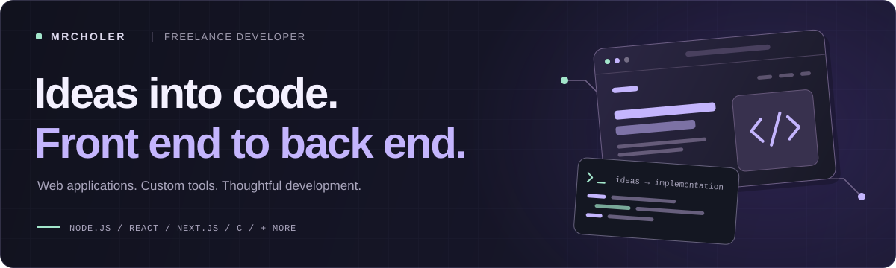
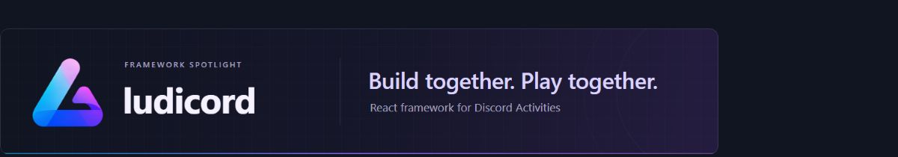
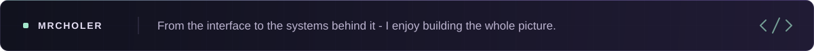

  

  <strong>Freelance developer</strong> &nbsp;·&nbsp; Web applications &nbsp;·&nbsp; Developer tools &nbsp;·&nbsp; Custom integrations

### Hey, I'm mrcholer 👋

I'm a **freelance developer** building websites, full-stack applications, and custom tools. I work across the front end and back end, turning ideas into interfaces, APIs, and working products.

My stack includes **Node.js, React, Next.js, HTML, CSS, JavaScript, TypeScript, and C**.

> 🚧 **Currently building**
>
> Working on **[Ludicord](https://github.com/mrcholer/ludicord)** - making Discord Activities easier to build with React, from the first screen to real-time multiplayer.
>
> `React` · `Node.js` · `TypeScript` · `WebSockets`

### Tools I work with

  
  
  
  
  
  
  

  
  
  
  
  
  

### What I build

- **Websites & web apps** - responsive interfaces with HTML, CSS, React, and Next.js.
- **Back ends & integrations** - Node.js services, APIs, and real-time features.
- **Developer tools & frameworks** - reusable foundations that make building easier.
- **Interactive experiences** - multiplayer games and Discord Activities with Ludicord.

  

**A full-stack React framework for building Discord Activities.**

Routing, authentication, APIs, WebSockets, and shared multiplayer state - bringing the pieces of a Discord Activity into one framework.

  
  
  

[Explore Ludicord →](https://github.com/mrcholer/ludicord) &nbsp; [Read the docs →](https://github.com/mrcholer/ludicord/blob/main/docs/README.md)

### More of my work

| Project | What it does |
| :--- | :--- |
| **[Discord Roulette](https://github.com/mrcholer/discord-roulette)** | A TypeScript roulette engine with animated wheels, multiplayer lobbies, and optional Discord.js integration. |
| **[Low-Level Programming Guide](https://github.com/mrcholer/Low-Level-Programming-Guide)** | A practical guide to C, memory, pointers, and the systems underneath your code. |
| **[Ludo Activity](https://github.com/mrcholer/LudoGame-Activities)** | Multiplayer Ludo inside Discord, with real-time game state and player synchronization. Built with Ludicord. |
| **[Tic-Tac-Toe Activity](https://github.com/mrcholer/Discord-Tic-Tac-Toe-Activities)** | A real-time multiplayer take on a classic, built as a Discord Activity with Ludicord. |

[Browse all my repositories →](https://github.com/mrcholer?tab=repositories)

  

